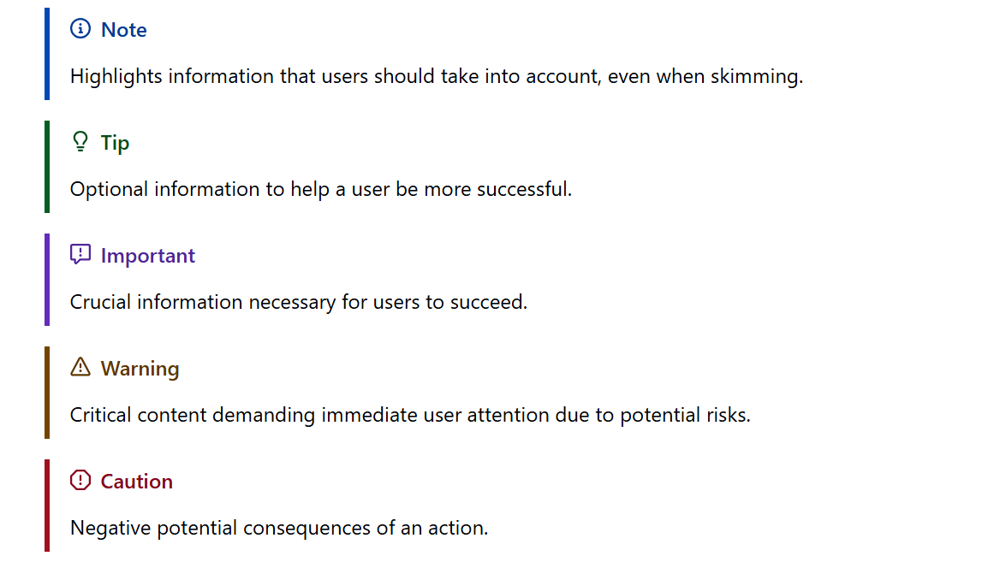

# Github Alerts

[](https://github.com/alan-null/joplin-plugin-github-alerts/releases/latest)
[](https://opensource.org/licenses/MIT)

**[GitHub Alerts](https://github.blog/changelog/2023-12-14-new-markdown-extension-alerts-provide-distinctive-styling-for-significant-content/)** are a Markdown extension based on the blockquote syntax that you can use to emphasize critical information.
They are displayed with distinctive **GitHub** colors and icons to indicate the significance of the content.



## Usage

Markdown example:
```
> [!NOTE]
> Highlights information that users should take into account, even when skimming.

> [!TIP]
> Optional information to help a user be more successful.

> [!IMPORTANT]
> Crucial information necessary for users to succeed.

> [!WARNING]
> Critical content demanding immediate user attention due to potential risks.

> [!CAUTION]
> Negative potential consequences of an action.
```
### Customization

Alternative titles are supported by appending them to the marker like this:

```markdown
> [!note] Nota bene
> The custom title will replace the regular title.
```

## Functionality

This plugin transforms the following markdown:

```markdown
> [!NOTE]
> Highlights information that users should take into account, even when skimming.
```

to the following HTML:

```html
<div class="markdown-alert markdown-alert-note">
  <p class="markdown-alert-title" dir="auto"><!-- svg icon-->Note</p><p>
  Highlights information that users should take into account, even when skimming.</p>
</div>
```

Which is compatible with GitHub's output.


## License
[MIT License](LICENSE.md) © Alan Płócieniak